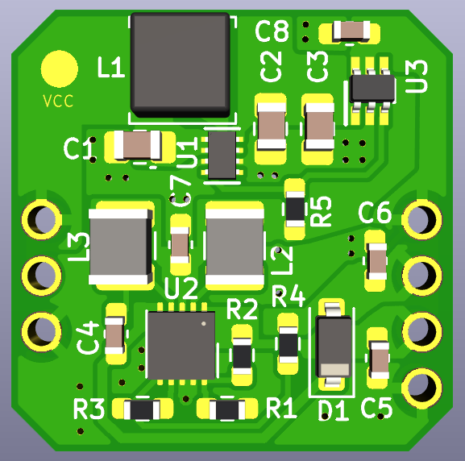
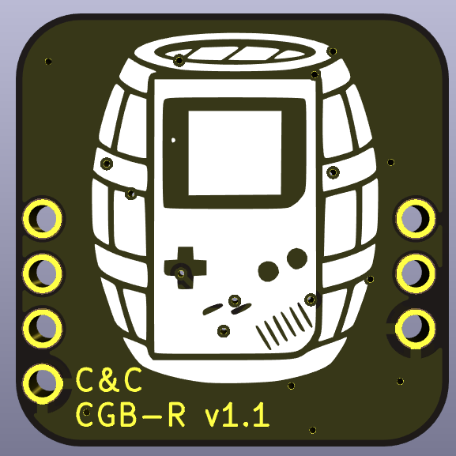
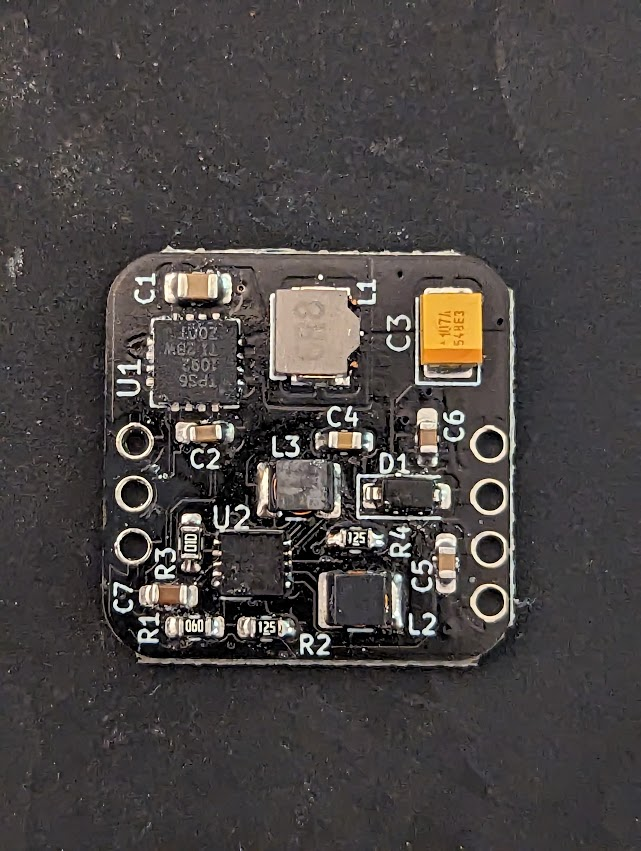
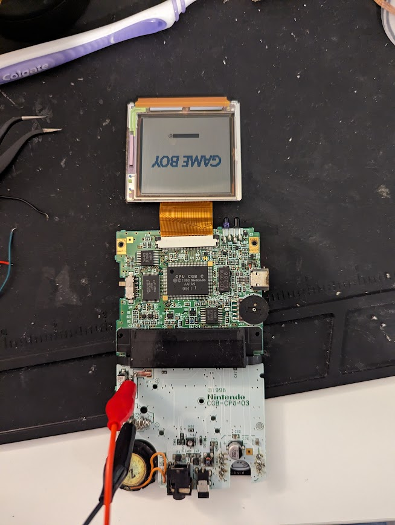

# CGB-R
The C&C CGB-R is a new Game Boy Color power regulator board with power rails for the OEM screen

## Description

Many modern Game Boy power regulators forgo the higher voltage connections required by the original LCD screen under the assumption that the user will want to use a newer, modern IPS or similar screen. This regulator board uses a high efficiency +5v regulator IC and adds an additional regulator IC and circuit (Linear Technology/Analog Devices LT3463/LT3463A) to generate the 13.6V and -15V for input to the original CGB screen.

## BOM

Currently being revised for alternative components
<!--
| Reference | Qty | Value          | Footprint |
|-----------|-----|----------------|-----------|
| C1, C2    | 2   | 22uF           | 805       |
| C3, C4    | 2   | 0.1uF          | 603       |
| C5, C6    | 2   | 1uF            | 603       |
| D1        | 1   | B0540          | SOD-123   |
| L1        | 1   | 2.2uH          | 1212      |
| L2, L3    | 2   | 10uH           | 1210      |
| R1        | 1   | 121K           | 603       |
| R2, R4    | 2   | 1.2M           | 603       |
| R3        | 1   | 100K           | 603       |
| U1        | 1   | TPS61202DRC    | VSON-10   |
| U2        | 1   | LT3463AEDD-PBF | DFN-10    |
-->

## Compatibility

This board should be compatible with stock CGB motherboards. I have tested on CGB-CPU-03 (CPU-CGB-C). It should also be compatible with N64-freak Pocket-Color and Light-Color conversion boards (_IT IS NOT COMPATIBLE_ with skimzor PoCo or Bucket Mouse MGBC as these do not have the CGB-REG IC). 

Hand cut or Natalie-the-nerd pocket color boards require running wires from pins 5 and 6 to the appropriate vias for the -15V and 13.6V rails, as well as relocating R20 and VR2 for CGB-REG, as these components are on the bottom half of the CGB board. I hope to have a tutorial for this particular configuration available in the near future.

## Testing

Although confirmed to be working, I plan to test some alternative values for some of the passive components as well as doing some battery-life trials (comparing with the OEM regulator), power measurements/stability analysis, and reviewing performance on AA and AAA batteries as well as NiMH vs Alkaline.

## License

[Creative Commons Attribution-ShareAlike 4.0 International (CC BY-SA 4.0)](https://creativecommons.org/licenses/by-sa/4.0/)

You are free to:

Share — copy and redistribute the material in any medium or format

Adapt — remix, transform, and build upon the material

for any purpose, even commercially.
