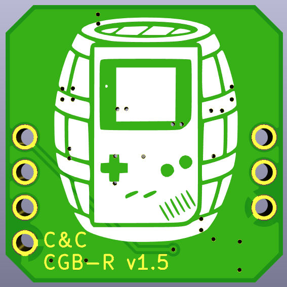

# CGB-R
The C&C CGB-R is a new Game Boy Color power regulator board with power rails for the OEM screen

## Description

Many modern Game Boy power regulators forgo the higher voltage connections required by the original LCD screen under the assumption that the user will want to use a newer, modern IPS or similar screen. 

This regulator board uses a high efficiency +5v regulator IC and adds an additional regulator IC and circuit (Linear Technology/Analog Devices LT3463/LT3463A) to generate the 13.6V and -15V for input to the original CGB screen, to create a replacement for the stock regulator using off-the-shelf parts and parts only soldered on one side of the board.

## BOM
| Reference | Qty | Value          | Footprint |
|-----------|-----|----------------|-----------|
| C1, C2, C3    | 3   | 22uF           | 0805       |
| C4    | 1   | 0.1uF          | 0603       |
| C5, C6, C8    | 3   | 1uF            | 0603       |
| C7 | 1| 10uF | 0603 |
| D1        | 1   | B0540          | SOD-123   |
| L1        | 1   | 1uH          | Coilcraft XGL4020 (use others at own risk)    |
| L2, L3    | 2   | 10uH           | 1210      |
| R1        | 1   | 121K           | 0603       |
| R2, R4    | 2   | 1.2M           | 0603       |
| R3        | 1   | 100K           | 0603       |
| R5        | 1   | 10K           | 0603       |
| U1        | 1   | TPS61033/TPS610333    | SOT-583   |
| U2        | 1   | LT3463AEDD-PBF | DFN-10    |
| U3 | 1 | TPS22919DCKR | SC-70 |

## Compatibility

This board should be compatible with stock CGB motherboards. I have tested on CGB-CPU-03 (CPU-CGB-C). It should also be compatible with N64-freak Pocket-Color and Light-Color conversion boards (_IT IS NOT COMPATIBLE_ with skimzor PoCo or Bucket Mouse MGBC as these do not have the CGB-REG IC). 

Hand cut or Natalie-the-nerd pocket color boards require running wires from pins 5 and 6 to the appropriate vias for the -15V and 13.6V rails, as well as relocating R20 and VR2 for CGB-REG, as these components are on the bottom half of the CGB board. I hope to have a tutorial for this particular configuration available in the near future.

## Testing
The current design is my 6th revision of this board so it has gone through many iterations. I've changed the primary regulator multiple times and added the load switch to help with the sequencing, low power shutdown, and inrush current concerns. My testing shows this is at least comparable in efficiency as a stock regulator, perhaps slightly more efficient. Life testing has shown it to improve on stock under most of my tests. It powers on with AAA NiMHs at 2.0v, but won't do that with an EZ-Flash in the system.

I have analyzed version 1.3's noise, inrush, and various other factors on an oscilloscope and compared those to stock. This was part of the reason for adding the load switch on the output. By the numbers, the regulator is "less noisy" than stock - but due to the cyclical nature of that noise - it does reflect a small hum onto the input rail. Because the CGB runs the audio amp off of the batteries directly, this noise is slightly audible (and will vary system to system). While system volume is set high, this audible noise is LESS than the stock CGB. When the system volume is set low, the audible noise is higher than a stock CGB.

## License

[Creative Commons Attribution-ShareAlike 4.0 International (CC BY-SA 4.0)](https://creativecommons.org/licenses/by-sa/4.0/)

You are free to:

Share — copy and redistribute the material in any medium or format

Adapt — remix, transform, and build upon the material

for any purpose, even commercially.
